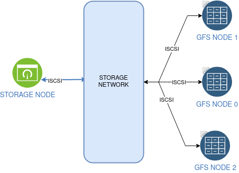

# Peacemaker cluster, iscsi, gfs

Развертывание инфраструктуры на advacedHosting при помощи Terraform.
Создание кластиера при помощи ansible.

На машине администратора должен быть установлен плагин [advacedHosting](https://github.com/advancedhosting/terraform-provider-ah)

* Роль storage-iscsi - подготовка блочного устройства, настройка iscsi target
* Роль gfs2 - создание кластера  pacemaker, подключение блочного устройства iscsi, создание LVM и файловой системы gfs2
* Схема стенда 

 


Развертывание инфраструктуры:
```
terraform init
terraform plan
terraform apply 
```
Провижн:
```
ansible-playbook site.yml
```

Проверка:
* проверка состояния кластера
    ```
    ansible-playbook -i ./hosts ./roles/gfs2/tests/pcs.yml --limit gfs-node-0
    ```
* создание файла 
    ```
    ansible-playbook -i ./hosts ./roles/gfs2/tests/create_file.yml --limit gfs-node-0
    ```
* перезагрузка одной из нод
    ```
    ansible-playbook -i ./hosts ./roles/gfs2/tests/reboot.yml --limit gfs-node-1
    ```
* проверка состояния кластера
    ```
    ansible-playbook -i ./hosts ./roles/gfs2/tests/pcs.yml --limit gfs-node-0
    ```
* создание файла при двух работающих нодах
    ```
    ansible-playbook -i ./hosts ./roles/gfs2/tests/create_file.yml --limit gfs-node-0
    ```

